#  IBM Transactions Fraud Classification Project Report
**<u>Group members:</u>** Alec Groseclose, Everett Holmes, Logan Lay
**Spring 2025**

## Project Summary

For this project, we used the IBM Transactions for Anti Money Laundering dataset, which is a CSV of synthetic financial transactions. Most transactions are legitimate, with a small fraction being labeled as laundering. Each record has a binary tag indicating whetehr the transaction is considered suspicious, making this a binary classification problem.

Our primary goal was to detect laundering behavior by building a machine learning pipeline that handles class imbalance and evalauate smodel performance beyond just accuracy.
We began with a baseline Logistic Regression model, then improved performance through data normalization, class weighting, and SMOTE oversampling. We later introduced more advanced models such as Random Forest and XGBoost, while incorporating threshold tuning to boost recall on the minority class.

The key components of the approach we took were : Preprocessing, Feature Engineering, evaluating Fraud Detection, and then full Model Evaluation
## Problem Statement 

Can we accurately predict whether a transaction is laundering or legitimate based on its transactional features? 

We are choosing to approach this as a binary classfication problem with a baseline Logistic Regression model. This model serves as a benchmark due to its initial simplicity, interpretability, and effectiveness in high-dimensional, imbalanced datasets. The dataset itself comes from IBM's synthetic anti money laundering dataset, containing over 6.9 million labeled transactions that include both categorical and numerical entries. Naturally, a very small portion of these transactions are fraud. We consider informal success to be having strong classification performance on our training and testing split, with a focus on correctly idnetifying laundering transactions. Our goal is to establish a reliable baseline for detecting the laundering behavior, which we will then improve with future experiments.

To improve upon the baseline, we implemented Random Forest and XGBoost classifiers. These models were tested using class weighting and custom thresholding to better detect the minority class. Evaluation focused on improving recall and overall predictive balance while managing false positives. 

## Dataset Highlights and Attributes
Link to dataset - https://www.kaggle.com/datasets/ealtman2019/ibm-transactions-for-anti-money-laundering-aml?resource=download&select=LI-Small_Trans.csv

The dataset we are using is the IBM Transactions for Anti-Money Laundering (AML) dataset, specifically LI-Small_Trans.csv. It has a structured tabular format, contains 6,924,049 instances/rows and 11 attributes/columns. These include both categorical and numerical features, each row being a financial transaction. This gives us roughly 76 million entries.

As was mentioned the dimesions of the dataset is 6924049 x 11 with 76,164,539 entries. The attrbutes with their respective types and descriptions are Timestamp - object - Time Transaction took place,
From Bank - int64 - Bank Issuing transaction, 
Account - object - Account Originating Transaction, 
To Bank - int64 - Bank receiving transaction, 
Account1 - object - Account Receiving Transaction, 
Amount Received - float64 - Amount receiving party got, 
Receiving Currency - object - Currency Type to receive in, 
Amount Paid - float64 - Amount of money sent, 
Payment Currency - object - Currency sender paid in, 
Payment Format - object - How transaction was conducted (check, wire), 
Is Laundering - int64 - Whether or not transaction was laundering (1 - yes, 0 - no).

Since this is a supervised binary classification problem our benchmark is a Logistic Regression model traned using all the features. We used the following tools and libraries for preprocessing and model development: Pandas, Scikit-learn, Matplotlib, Seaborn, imblearn, and XGBoost.

We initially used this dataset and pipeline structure while testing Random Forest and XGBoost models. These additions enabled better exploration of the data's predictive power across various algorithm families and evaluation strategies.

Here are the images of the different preprocssing steps that were taken such encoding categorical variables, dropping missing, splitting target variables, and normalizing.
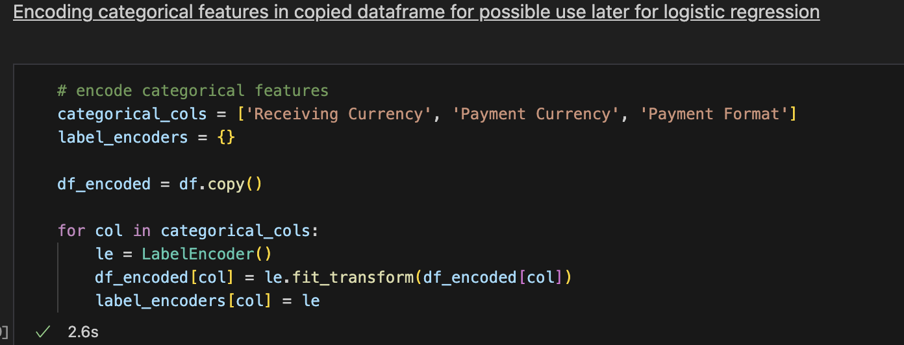
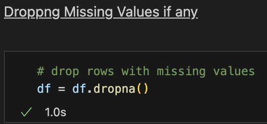
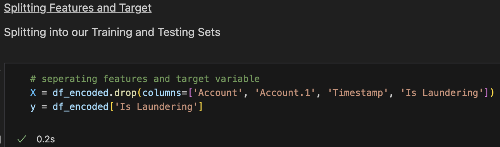
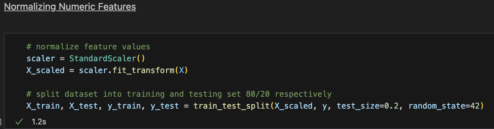

## Exploratory Data Analysis 

Some EDA graphs we are planning to use are a correlation heatmap to indentify any linear relationships between numerical variables and the target variable. We alo intend to use a class distribution bar plot if possible in order to visualize the class imbalance between the laundering and legitimate transactions.

For our Class Distribution Bar Plot we wanted to visualize the class imbalance, showing that over 99.95% of transactions were legitimmate, while less the 0.05% were laundering. This justifies our later use of class weighting, SMOTE, and tuning thresholds.
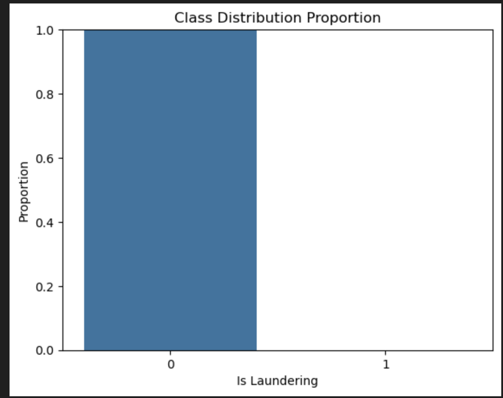

With the Correlation Heatmap we wanted to use it to examine correlations between numerical features such as Amount Paid and the target Is Laundering. While most features showed weak correlation with the target, this informed us that feature scaling would become useful and later we might need feature engineering.
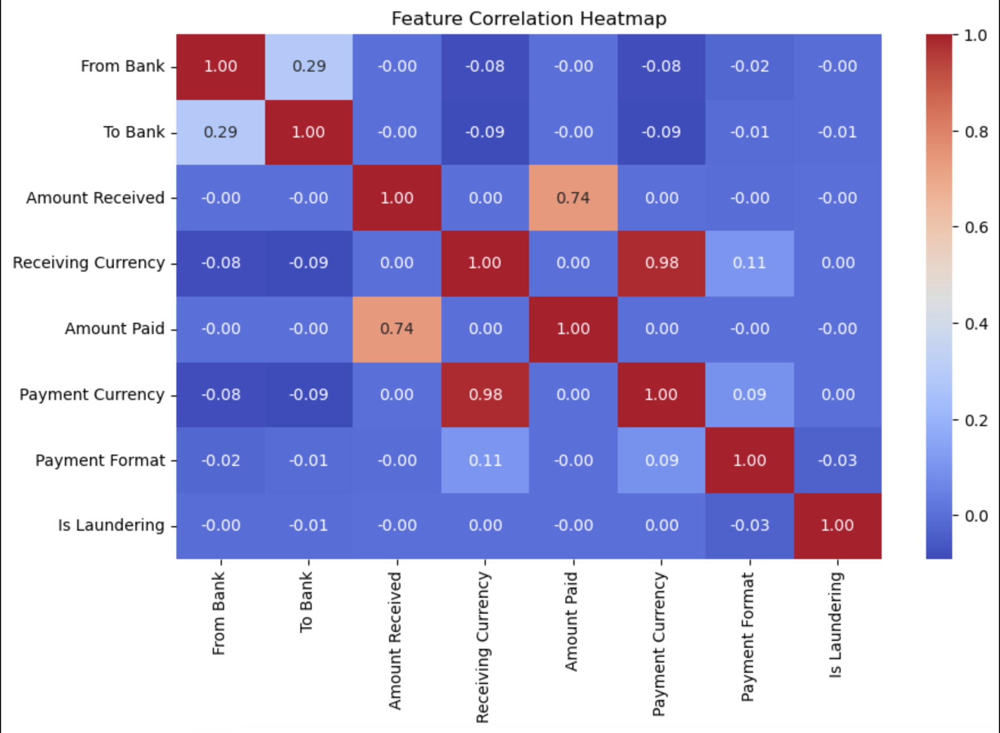

We normalized numeric features using StandardScalar before training our Logistic Regression model. This was necessary because the dataset included features with such vastly different numeric scales, such as the transaction amount raning from small values to millions. Without us doing normalization, features with larger scales disproportionately influenced the model.
Since tree based models like Random Forest and XGBoost dont require normalization, we made sure to maintain consistency across all model for comparability.

## Data Preprocessing 

Yes, we applied scalaing using StandardScaling to normalize our data. This was done after we encoded the categorical features and before training the Logistic Regression model. We did this because this ensures features like the amount dont dominate others due to the large scale of them during training.
The scaling was done by introducing scalar = StandardScalar(), we assigned the new X_Scaled to scaler.fit_transform(X), then of course split the training and testing data with 20% testing size and random state of 42.

We considered dimensionality reduction techniques like using PCA but decided not to apply them at this stage because we are focusing on the base model and its simplicity/interpretability. Also we only have 11 features so dimensionality has not become a huge issue yet.

Categorical variables such as Receiving Currency, Payment Currency, and Payment Format were encoded using LabelEncoder, allowing them to be used in all models without requiring encoding each time.
We also dropped non predicitve or high cardinality fields like Account, Account.1, and Timestamp so we could avoid overfitting issues and noise, especially moving toward the tree based models.

All models, including Logistic Regression, Random Forest, and XGBoost used this consistent prepreocessing pipeline. Although Random Forest and XGBoost are less sensitive to feature scaling, we maintained the normalized data across models to maintain consistency and comparability in evaluation.

## Machine Learning Approaches

Our baseline evaluation setup uses a Logistic Regression model trainined on the feature set which was preprocessed. This includes encoding categorical figures and normalizing numeric features, using an 80/20 train test split, and outputting accuracy, confusion matrix, as well as a classification report for performance evaluation.
We chose Logistic Regression because it is efficient and widely used in binary classification problems as well as provides a strong baseline before testing more complex models.

We later extended our experiments to include Random Forest and XGBoost classifiers, both powerful, non-linear models that are commonly used for fraud detection. For modeling we ussed the following dataset configurations, for Scaled Data (done with StandardScalar) for Logistic Regression and XGBoost. We used the original unbalanced set for Random Forest and XGBoost, but applied the class_weight = "balanced_subsample" or scale_pos_weight to handle our imbalances
With SMOTE we resampled the dataset for an improved Logistic Regression model by synthetically increasing the laundering class. Each of these models were selected for the following reasons, Logistic Regression is a great simple/interpretable baseline, Random Forest is good at capturing non-linear data interactions and can handle imbalances, finally XGBoost is a good gradient boosting method and can focus in on misclassified examples.

These tools informed the next steps by allowing us to compare performance across different learning algorithms, applying threshold tuning, and understanding how well each model handled the class imbalance. We confirmed that more complex models offered better recall for laundering transactions, which was a large objective in our fraud detection task.

## Experiments 

We conducted a series of experiemnts to evaluate and improve our ability to detect laundering trasactions within a highly imbalanced dataset. Here are their descriptions and respective confusion matrixes.

Our first experiments used a simple Logistic Regression model without normalization or class balancing achieving ~99% accuracy but it failed to detect any laundering transaction.
Next, we applied StandardScalar to normalize numeric features and added class_weight="balanced" to the Logistic Regression model. This resulted in a more meaningful performance of ~80% accuracy. The model also began to identify laundering cases with improved recall and balanced precision.
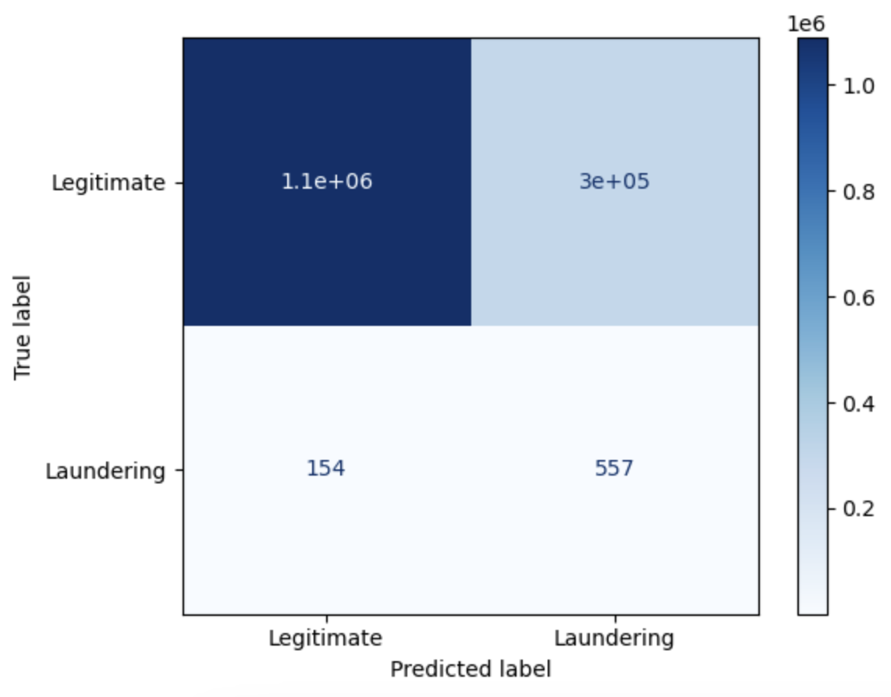

We then used the SMOTE technique to ovesample the minority class and train another Logistic Regression model. This gave us more balanced precision and recall ~.79 each meaning that oversampling had improved the models ability to detect fraud while keeping a fair prediction quality.
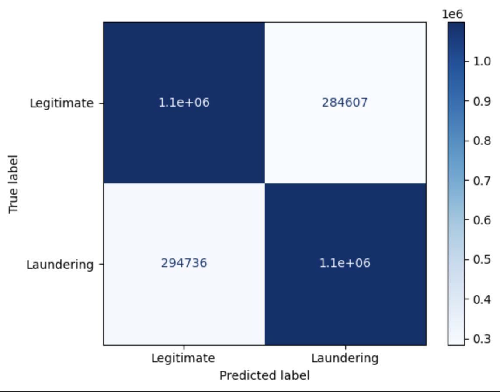

Next, we trained a Random Forest classifier using class_weight="balanced_subsample" and applied a custom probability threshold of 0.3 to increase the laundering detection. This model achieved ~87% accuract and significantly improved the recall for our laundering class.
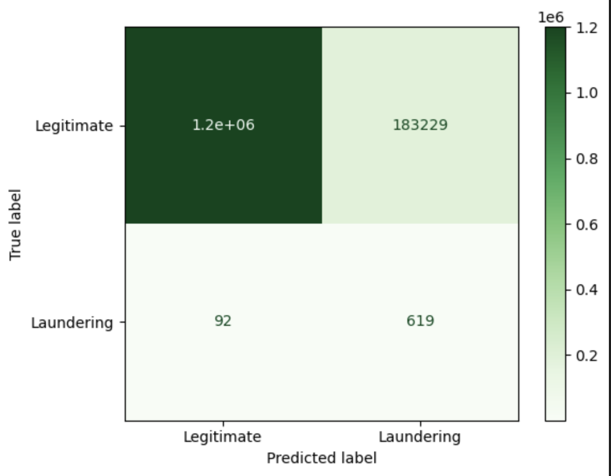

Finally, we trained an XGBoost classifier with a scale_pos_weight parameter the was tuned to reflect the class imbalance ratio. Using the same 0.3 threshold, the model achieved ~86% accuracy, high recall, and a strong prediction performance.
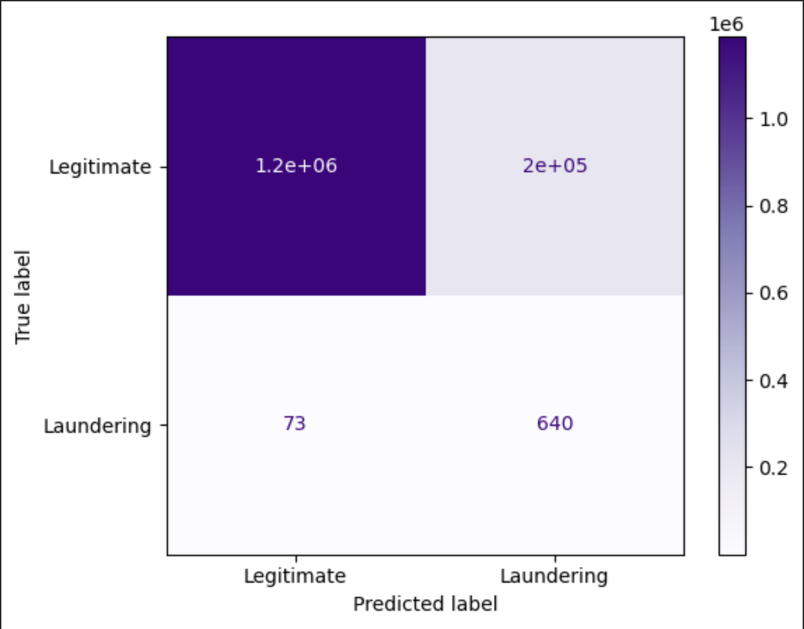

We evaluated all models using Accuracy, Precision, Recall, F1-score, and a Confusion Matrix. Threshold tuning and class weighting were key to improving recall on the minority class without overcompensating with false positives.

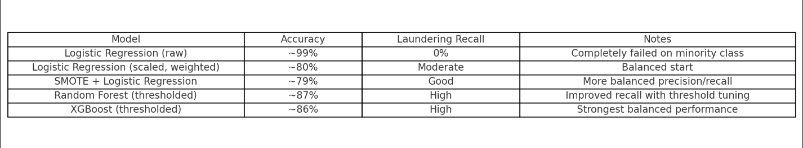

## Conclusion
For our IBM transactions dataset we evaluated many different algorithms with varying results. These were Logistic regression, SMOTE, Random forest classifer and XG Boost. Our initial Logistic regression model unfortunatly didn't perform as well as we were hoping. Evaluating with confusion matrixes showed us it had accuracy over 75% but the precision and recall for cases of laundering was almost zero. We improved the precision and recall by implementing SMOTE to handle the large class imbalence our dataset had, but the confusion matrix showed that transactions were still being mislabled. So we then experimented with the Random Forest Classifer model, which lead us to more accuratly predict fradulet cases but mislabeled more legitimate cases inaccuratly as laundering as shown in the confusion matrix. The Importance Plot for Random forest Classifier showed the model favored the payment format to be the most important thing the model used to classify fraud. Finally our last model was the XG Boost classifer which had the best results of all the models. The classification report and confusion matrix showed an accuracy of 92%, with precision, recall, and f1 score all over 80%. We also evaluated it's precision recall against the threshold to get an AUC_ROC curve of around .9. In conclusion we have determined that of the algorithms we tested, the XG Boost Classifer is the best model to use for our binary dataset.

 
## Personal Project Contribution
For this project I completed the entirety of the coding/models and testing in Model.ipynb except for the first 5 cells or so which are the inital dataset description(shape, info, type, sample). 
I attmpted to organize the group giving notes from class, reminding of future deadlines, setting meetings, and delegating pieces of the model, presentation, or report.
I helped to organize, write, and give feedback for the initial project proposal before changing our topic away from reviews. I also organized/delegated the final presentation slides so that other members contributed.

 

